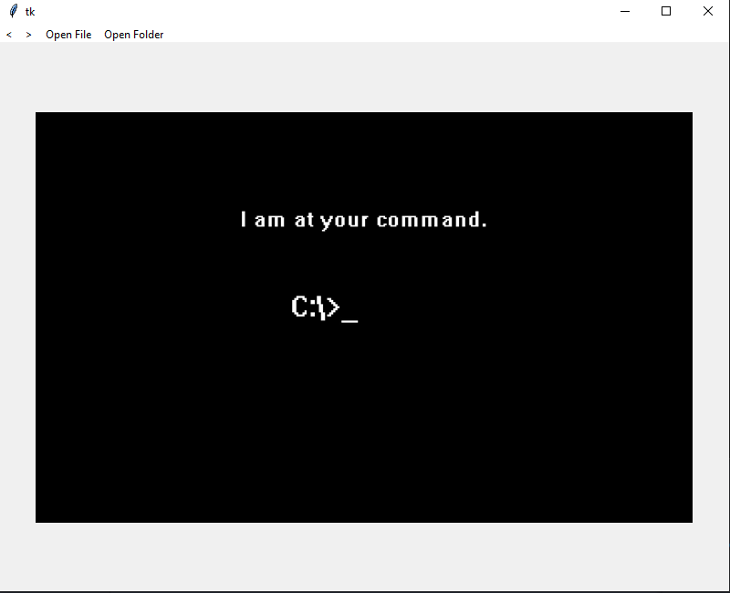

<center>

# Pyllery

</center>

<center>




</center>

> This project is a gallery built in python and it is meant to be lightweight.

## Improvements and Adjustments

The Project still under development and the every improvement or adjustment you can see inside the [TODO file](./TODO.md)

## 💻 Requirements

Before start using the software see if:

- You have a Windows, Linux or Mac machine.

- You have Python 3 installed.

- You have Pip installed

## 🚀 Installing pyllery

To install pyllery follow the instructions:
Linux, macOS and Windows:

```shell
pyinstaller pyllery/main.py --name pyllery --hidden-import='PIL._tkinter_finder'
```

This command will generate a binary file based on you operational system.

## ☕ Using pyllery

To use pyllery, follow those steps:

```shell
pyllery path/to/image/or/folder
```

or simple:

```shell
pyllery
```

and open the image or folder with the buttons inside the app.

Obs: For now this software does not have any option to put in the cli.

## 📫 Contributing to pyllery

Contributions are what make the open source community such an amazing place to learn, inspire, and create. Any contributions you make are **greatly appreciated**.

To contribute to pyllery, follow the instructions:

1. Fork this repository.

2. Create a branch: `git checkout -b <branch-name>`. (ref: [Semantic Branch Names](https://gist.github.com/seunggabi/87f8c722d35cd07deb3f649d45a31082))

3. Do your changes and commit it: `git commit -m '<commit-message>'`

4. Send to the original branch: `git push origin <branch-name>`

5. Create a pull request. (ref: [How to create a pull request](https://help.github.com/en/github/collaborating-with-issues-and-pull-requests/creating-a-pull-request)).

## 📝 License

This project is under MIT License. See the file [LICENSE](./LICENSE) for more details.
[⬆ Back To The Top](#pyllery)
